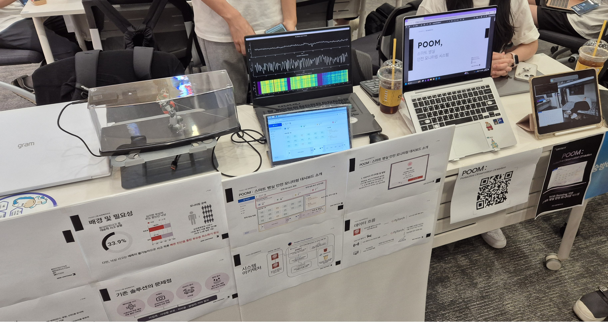

<h1 align="center">Hi, I'm Youngjin Won 👋</h1>

## 🚀 About Me
- 🛠️ Embedded & IoT Engineer focusing on **MCU firmware**, **real-time systems**, and **hardware-driven system integration**  
- 🧠 Specialized in **Embedded Systems**, **IoT Automations**, and **AIoT Prototyping**  
- 🎓 AI Convergence major at Soongsil University (4th semester), focusing on System Programming, Digital Systems, and Machine Learning  
- 🏫 **SSCC** (Soongsil Computing Club), overseeing academic programs and event planning/operations

---

## 📫 Contact

- 📧 [Email](mailto:wonyoungjin421@gmail.com)  

---

## 💼 Career

- 🎓 **2022.03.01 ~ Present**  
  [Soongsil Univ. – AI Convergence](https://aix.ssu.ac.kr/)
  
- 🏛️ **2022.03 ~ Present**  
  [**SSCC** (Soongsil Computing Club)](https://github.com/SoongSilComputingClub)  
  > 2023.01 ~ 2023.06: Director of Academic Affairs  
  > 2025.01 ~ Present: Vice President  

---

## 🏆 Prize

🏆 *2025.04.30 ~ 2025.12.05*: **2025 제23회 임베디드 소프트웨어 경진대회**  
🥇 금상 – LG전자 CTO상
- Project: [SOOM (Sleep Observation & Optimization Module)](https://github.com/Dongbang-Yeuijiguk/2025ESWContest_smart_3019)
- Sector: [스마트 가전 부문](https://www.eswcontest.or.kr/competition/webos.php) (LG전자 후원)
- Team: 동방예의지국
- Part: Team Leader · Project Manager · Embedded System 
- Organization: 산업통상자원부(주최), KESSIA-임베디드소프트웨어·시스템산업협회(주관)

---

🏆 *2025.08.07 ~ 2025.08.13*: [**2025 교내 연합 해커톤 UNITHON**](https://www.instagram.com/p/DLERFP8SP3v/?utm_source=ig_web_copy_link&igsh=NTc4MTIwNjQ2YQ==)  
🥉 우수상 – 스파르탄SW교육원 원장상
- Project: [POOM (Protective Observation Of Motion)](https://github.com/Soongbang-Yeuijiguk) (Wi-Fi Sensing 기반 스마트 병실 안전 모니터링 시스템)
- Team: 숭방예의지국
- Part: Project Manager · Embedded System · Business strategy
- Organization: 숭실대학교 IT대학 학생회(주최), 숭실대학교 창업지원단·스파르탄SW교육원(주관)

---

## 🎤 Exhibition

📢 *2025.08.13~2025.08.13* [**2025 교내 연합 해커톤 UNITHON**](https://www.instagram.com/p/DLERFP8SP3v/?utm_source=ig_web_copy_link&igsh=NTc4MTIwNjQ2YQ==)  

- Project: [POOM (Protective Observation Of Motion)](https://github.com/Soongbang-Yeuijiguk) (Wi-Fi Sensing 기반 스마트 병실 안전 모니터링 시스템)
- Organization : 숭실대학교 IT대학 학생회(주최), 숭실대학교 창업지원단·스파르탄SW교육원(주관)
- Location : 숭실대학교 한경직기념관 김덕윤 예배실
- Period : 2025.08.13~2025.08.13  
    

---

## 💻 Project

📚 *2025.03.09 ~ 2025.09.19* [**SSCCtal**](https://github.com/SSCC-Library)
> It provides a book rental service by scanning the barcode of the book, a book list status through a webpage, and an administrator function.
- SSCC 동아리방 도서 대여 시스템
- Role: Project Manager & Kiosk System

---

## 🧸 Toy Project

📷 *2022.06 ~ present*: [**SSCCounter**](https://github.com/SoongSilComputingClub/SSCCounter)  
- 동아리방 이용자 수 확인 시스템
- YOLOv3-based person detection

🏠 *2022.11 ~ 2022.12*: [**Smart-Home System**](https://github.com/AI-WonYJ/Smart-Home)  
- 실내 환경 데이터를 이용한 스마트홈 시스템 개발
- 대시보드를 통한 가전 제어

---

## ⚒️ Tech Stack
💡 **OS**  

### Core Languages 🧑‍💻  

### Sub Languages 🧑‍💻  

### AI & Data Science 🧠  

 

### Web Frameworks & API 🌐
 
 
 

### Databases 🗄️

### Development Tools & Platforms 🖥️
  | **Category** | **Tools & Platforms** |
  | :---: | :--- |
  | **`3D Modeling`** |    |
  | **`Hardware Platforms`** |    |
  | **`PCB & Circuit Design`** |     |
  | **`DevOps, Cloud & Virtualization`** |     |
  | **`Version Control`** |   |
  | **`IDE & Code Editor`** |      |
  | **`Operating System`** |    |
  | **`Collaboration & PM`** |     |
  | **`Office`** |   |
  | **`Utilities & Media`** |    |
  | **`Generative AI`** |    |

---

## 📊 Stats

 

 

---
